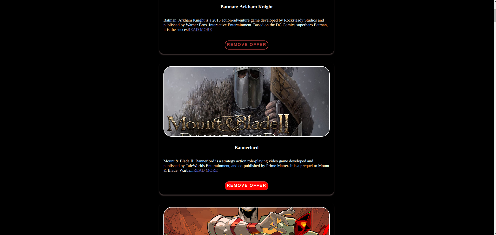
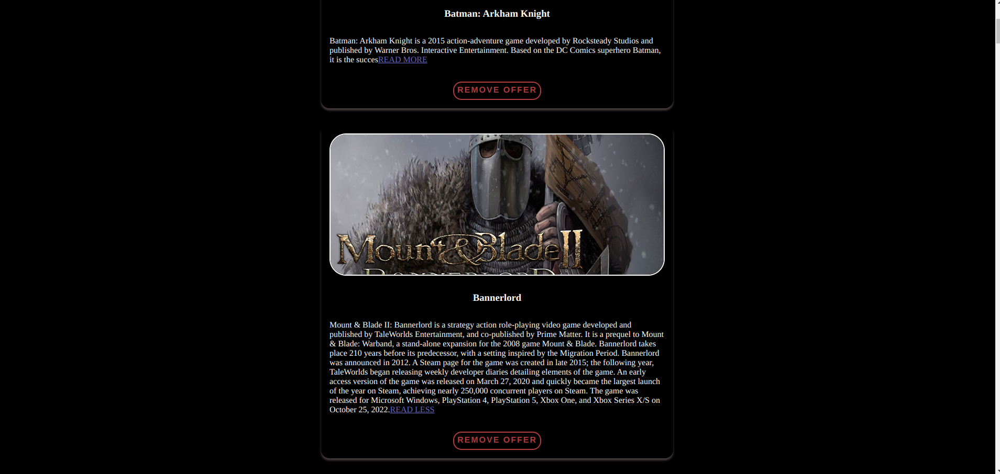

# GAMES PROJECT

## FULLSTACK REACT PRACTICE PROJECT NO: 2

1. I created this project to practice my skills using Javascript, React, NodeJS, ExpressJS, MongoDB, HTML, CSS.

2. I practiced useState and useEffect hooks.

3. This is an information page for games which you can remove or read more about them.

4. It tries to get the data from the cloud. If it won't be successful it gets the information from the local hobbits.js file. Because there is no password of my cloud account in this repository, it will take the data locally

5. You can dismiss one by one
